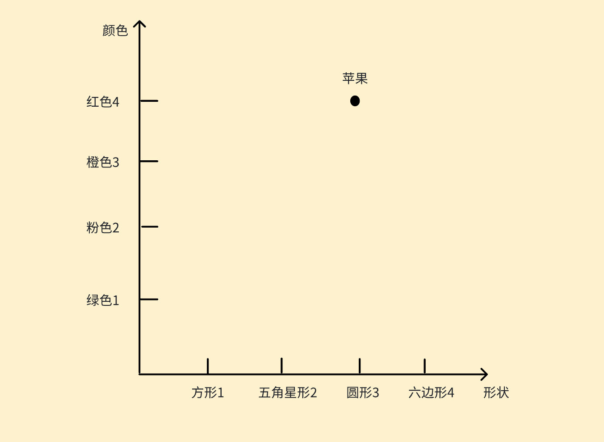
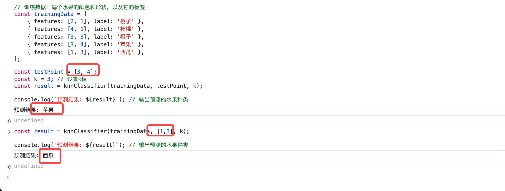

# k 临近

机器学习中的一种分类算法，首先解释一下机器学习这个概念。机器学习，顾名思义就是机械式的学习。<br>

举个简单的例子，小朋友是如何学习的？回顾一下自己小时候，我们是如何认识物品的？<br>

比如说苹果，小时候我们是如何认识苹果的？ <br>

是不是首先大人们先拿出一个苹果，然后放到我们眼前，并和我们说，这是苹果，苹果是红红的，圆形的，绿色叶子的，可以吃的。<br>

于是我们后面再看到“红红的”、“圆形的”、“绿色叶子的”、“可以吃的”，我们就知道了，这是苹果<br>

这便是机械学习，即一开始存在普遍认知，让孩子们接受这个认知，并以此分类水果，例子中的 “红红的”、“圆形的”、“绿色叶子的”、“可以吃的” 便为 ”特征“。<br>

而 k 临近算法便是机械学习的一种，具体方法其实很简单，利用了高中知识中的直角坐标系距离计算方法即 d=((x2-x1)^2+(y2-y1)^2)^1/2 <br>

如何理解呢？还是以前面的苹果为例，简单点我以二维坐标为例，将特征作为坐标系 x/y 轴，比如说纵坐标是“颜色”，横坐标是“形状” <br>

而 x 坐标的 3 为圆形，y 坐标的 4 为红色，我们可以知道满足 “苹果” 特征的点为 [3,4]（也就是之前举例中的**先拿出一个水果，告诉我们这是苹果**）<br>

<br>

换句话说，是不是距离点 [3,4] 越近，那么着该物品是苹果的概率就越高？那就可以用到直角坐标系计算距离公式了,**k 临近则是利用这个原理，计算训练数据中距离目标最近的 k 个点，来对目标进行分类**<br>

以下是 js 代码实现

```
function knnClassifier(trainingData, testPoint, k) {
    function euclideanDistance(point1, point2) {
        return Math.sqrt(Math.pow(point1[0] - point2[0], 2) + Math.pow(point1[1] - point2[1], 2));
    }

    const distances = trainingData.map(data => {
        return {
            label: data.label, 
            distance: euclideanDistance(data.features, testPoint)
        };
    });

    distances.sort((a, b) => a.distance - b.distance);

    const kNearestNeighbors = distances.slice(0, k);

    const labelCount = {};
    kNearestNeighbors.forEach(neighbor => {
        labelCount[neighbor.label] = (labelCount[neighbor.label] || 0) + 1;
    });

    let maxCount = 0;
    let predictedLabel = null;
    for (const label in labelCount) {
        if (labelCount[label] > maxCount) {
            maxCount = labelCount[label];
            predictedLabel = label;
        }
    }

    return predictedLabel;
}

// 训练数据：每个水果的颜色和形状，以及它的标签
const trainingData = [
    { features: [2, 1], label: '桃子' }, 
    { features: [4, 1], label: '杨桃' }, 
    { features: [3, 3], label: '橙子' }, 
    { features: [3, 4], label: '苹果' }, 
    { features: [1, 3], label: '西瓜' }, 
];

const testPoint = [3, 4];
const k = 3; // 设置k值
const result = knnClassifier(trainingData, testPoint, k);

console.log(`预测结果: ${result}`); // 输出预测的水果种类

```

我们运行看看,发现确实没错，鉴别分类出来了


# 树决策

