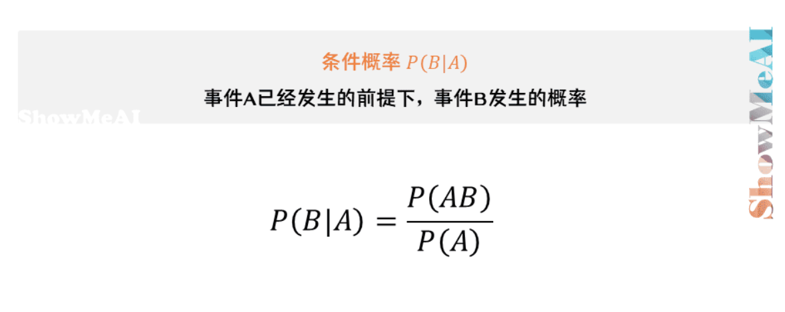
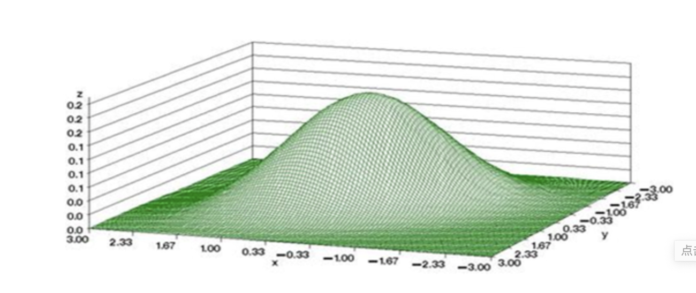
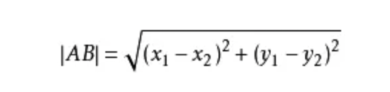
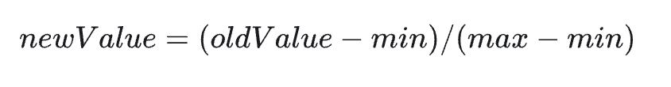
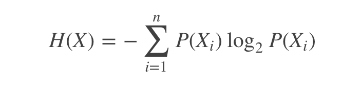
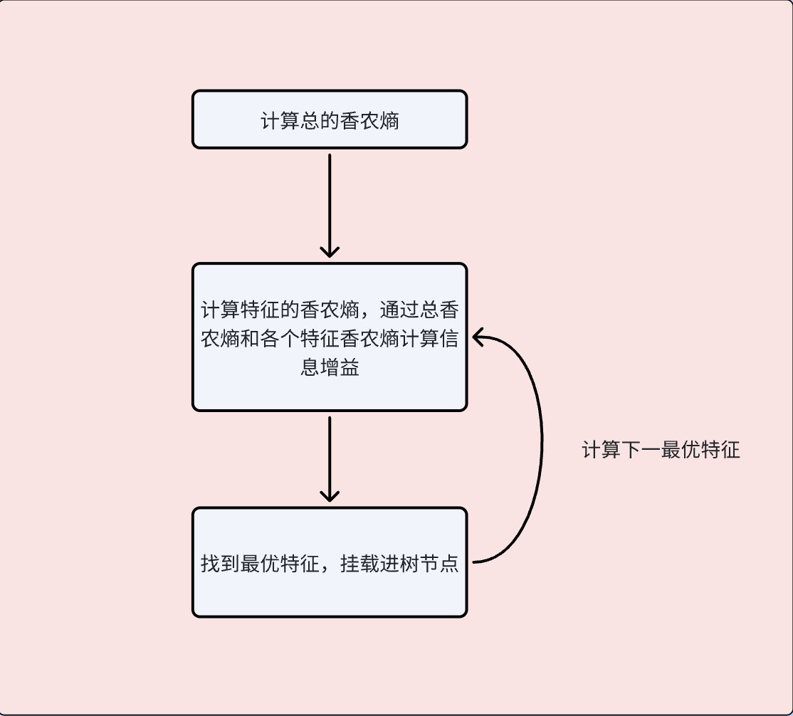

# 三大将

## 监督学习
TODO
## 非监督学习

TODO
## 强化学习
TODO

# 监督学习 

## 朴素贝叶斯

核心为贝叶斯定律：

关于这个定律，用三维概率密度图来理解会比较方便，如 P(XY) 发生的概率就相当于三维概率密度图中逼近（X,Y) 坐标区域的体积，
而 X 发生的概率就相当于横坐标为 X 逼近极限沿着 y 方向切下来的一块薄薄的切片。那么这个公式就很好理解了，已知 X 发生下 Y 发生的概率就相当于 P(XY) 在 P(X) 中的体积占比。即 P(Y|X)=P(XY)/P(X)

## K 邻近 （回归/分类）

这个比较好理解，大致就是将数据源打上各种标签，而给的新的数据源越接近某些标签的数据源，则说明该新数据大概率也符合对应标签
核心公式  

其中 x,y 都是数据的各种特征，若有更多特征，按照规律延展即可。
k 邻近中，由于各个特征量可能数量级不同，影响权重的容易偏向量级最大的，可以使用数据归一化处理,将所有数据均处理成 0～1 之间占比。 

大致的算法为
1、计算数据源与每一个样本数据的“距离”
2、将这些距离从小到大排序，取出最近的 k 个样本源
3、根据最近的这 k 个样本源的标签给出新的数据标签

## 决策树 

这块需要的背景知识比较多，先从香农熵介绍开始，首先先说明一个概念-“概率越大的事情发生，其信息量越小，概率越小的事情发生，其信息量越大”
举个简单的例子，太阳从东边升起与现在脚下发生大地震，前者大家都普遍知道，不需要多少信息量就能得出，后者则需要很多信息量才可能预测出其概率。而为了描绘这个定义，于是便选择了以负对数函数进行拟合，至于 2 为底数则是方便于计算机。这个公式有个十分有趣的一点，概率为 1 或者概率为 0 的事件，信息熵都是 0，一定发生和不可能发生的事都没有信息价值（笑）。 

我们前面说了如果某个特征信息量越大，不确定性也就越大，那么也就说明这个特征更加能决定样本的分类（即如果我们知道了此特征的具体信息，将会比其他特征更容易判断目标）。举个例子，假设有一个未知的水果，其有颜色，大小，气味等特征，很显然，颜色将会比大小更助于我们判断这个未知水果等类别，那么他就会有更大的信息增益，而决策树的核心就是通过信息增益不断选择最优特征，最终构建出场景的最佳树模型，再通过树模型进行分类或者回归。

# 参考文章

https://tianchi.aliyun.com/notebook/414249  
https://liaoxuefeng.com/blogs/all/2023-08-29-bayes-use/index.html 
https://zhuanlan.zhihu.com/p/28656126  
https://www.cnblogs.com/anai/p/12160754.html  
