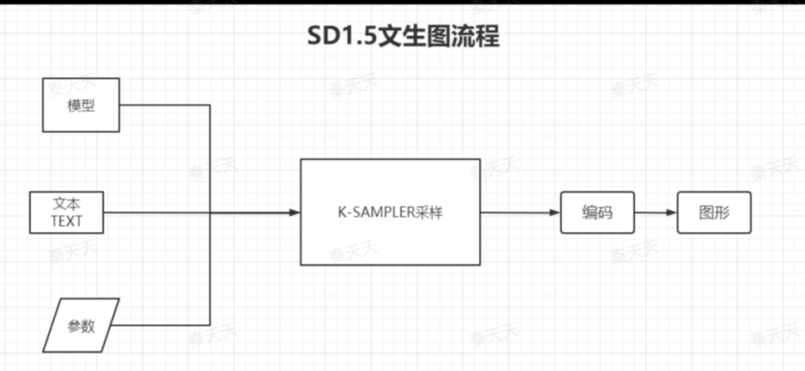
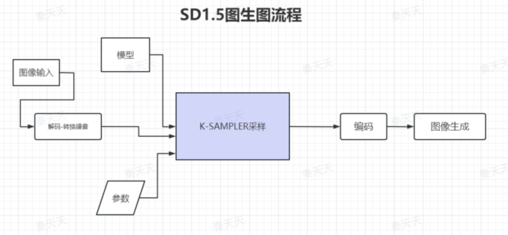

# ComfyUI 学习笔记 (持续更新 ing)

随着 GPT 等一系列语言模型的兴起，AI 逐渐走向大众视野，而在图片生成方面，则是另一个名为 stable diffusion (稳定扩散)模型

ComfyUI 则是一种快捷实用 stable diffusion 的工具，其核心概念是工作流，通过 UI 的节点和连线达成 stable diffusion 的工作流程。

这里顺带浅浅提一下 stable diffusion 的原理，个人认为挺惊艳的。大致的原理为用户输入一系列条件，然后 AI 利用条件中的分布信息，将一张随机噪点图进行逐步去噪，最终形成符合条件的图像，有点像雕刻家随手捡起一块石头最终雕刻成艺术的感觉。

## 基本概念

在 ComfyUI 中有以下几个核心概念 CheckPoint、KSampler、CLIP、Latent、VAE、Lora，下面我将一一描述 

CheckPoint:用于加载大模型，可以理解为基础模型，不同的基础模型将会有不同的表现效果。 

Lora:全称**Low-Rank Adaptation of Large Language Models** ，不是古墓丽影的劳拉，这个结合着 CheckPoint 一起讲，一般来说大模型都有着几十亿个参数，而这么多参数通过人为去控制显然不太靠谱，于是那些鬼才们便设计了 Lora 这个概念，可以把大模型理解为一个全能的人，但是指挥起来很麻烦，而 Lora 则是在某一专业领域做的特别强的人，通过 Lora 我们仅需少量配置就可达到 90% 的预期效果。 

CLIP:全称**Contrastive Language–Image Pre-training**，简单理解就是 AI 用于联系文字与图像之间模型，前面我们说了 stable diffusion 的工作原理，是从随机噪点图中根据“条件”不断进行去噪操作，最终生成满足条件的图片，而 CLIP 便是链接图像与文字的桥梁，也就是“条件”  

latent:潜空间，简单理解就是图片的数据流空间，计算机看到的和我们看到的东西是不一样的，初步的图形生成其实只是一些数据，需要通过 VAE 解码才能成为我们人眼看到的图片

VAE:加解码器，一般位于工作流的最开始（上传图片需要加码）或最结束（保存图片需要解码）。

KSampler: K 采样器，工作流的中心，把 CheckPoint 加载的模型比作大脑，那么 KSampler 就是手脚，他综合了 Model、Lora、CLIP 等条件，执行他们的内容并最终将图片输出在潜空间里。

## 基本工作流

使用 ComfyUI 生成图片基本都遵循以下流程

## 好用的平台

[哩布哩布](https://www.liblib.art/comfy?opencomfy=workflowData-18935273&comfyname=%E3%80%90AI%E6%BB%A4%E9%95%9C%E3%80%91%E4%B8%87%E7%89%A9%E7%9A%86%E5%8F%AF%E7%BE%8A%E6%AF%9B%E6%AF%A1v1&comfyOrid=7e244b4875b444e7af7fd807cf28ae1b)-有在线 ComfyUI 生成以及工作流下载等功能，可在线生图，功能很强大，在 ComfyUI 工作流这块更像是一个社区。

[fal.ai](https://fal.ai/)-一个云算力租借平台，支持导入 ComfyUI 工作流，可将你的工作流托管到平台之上，可自定义节点等，按使用次数计费，此类平台是目前商用出图的低成本选择。

[端脑云](https://cephalon.cloud/aigc)-云算力租借平台，支持导入 ComfyUI 工作流， 支持自定义节点及 Flux，按小时计费。

## 参考

[https://aigcreative.feishu.cn/wiki/VTqgwLTziiK8H9kJuUXcH0kMnTh](https://aigcreative.feishu.cn/wiki/VTqgwLTziiK8H9kJuUXcH0kMnTh)**!良心好文**

[https://aisc.chinaz.com/jiaocheng/ComfyUI.html](https://aisc.chinaz.com/jiaocheng/ComfyUI.html)

[b站 up主-Nenly同学](https://space.bilibili.com/1814756990)