# 数据库的基本结构

数据库是以表的形式进行管理的，把应用比作一个人，那么前端就是应用的四肢/感官，负责接触感知外界，接口则是神经元，将各种信息传递给上级，数据库则是大脑，负责贮存所有信息。
可以通过可视化工具 Navicat 链接到数据库，基本结构为服务器-数据库-表-列/行，以下为一个基本的数据库表。<br>
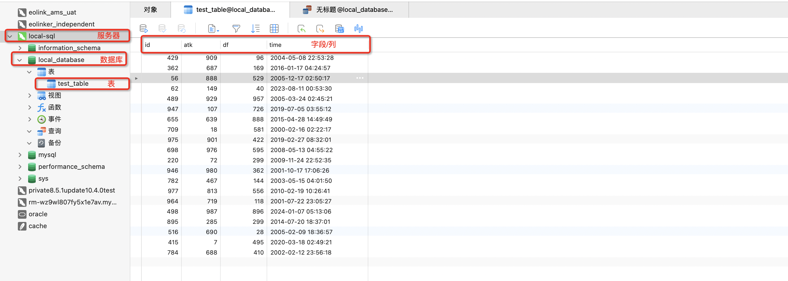

**数据库的操作主要分为四类-增/删/查/改**

## 查

示例表的全部内容<br>
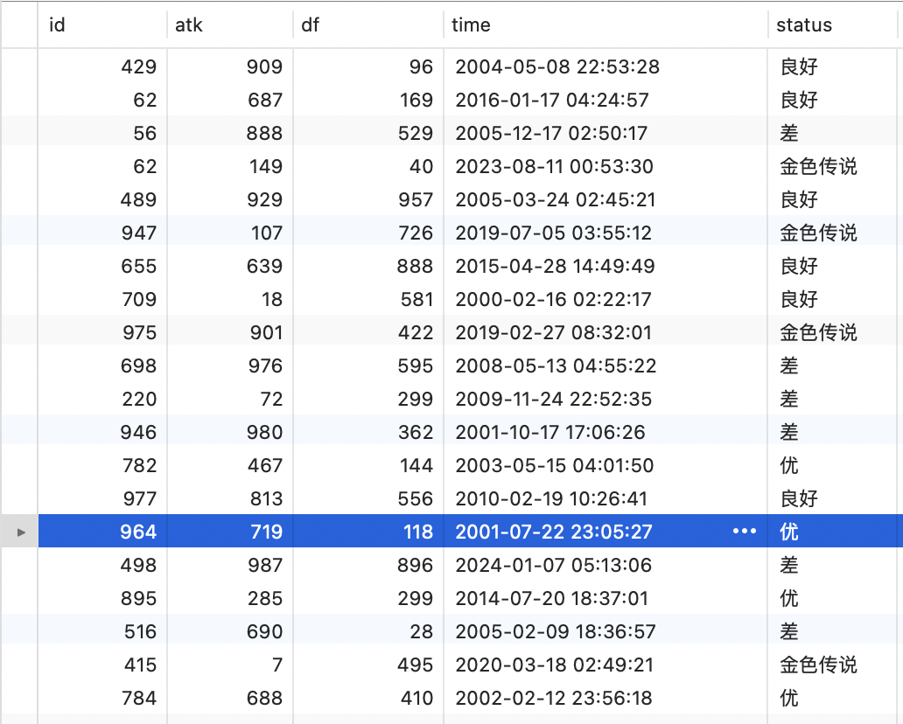

**1、SELECT <列名> FROM <表名> WHERE <条件>**

<列名> 为 \* 时，代表查询出满足<条件>的全部列

```
SELECT * FROM test_table WHERE df<100
```

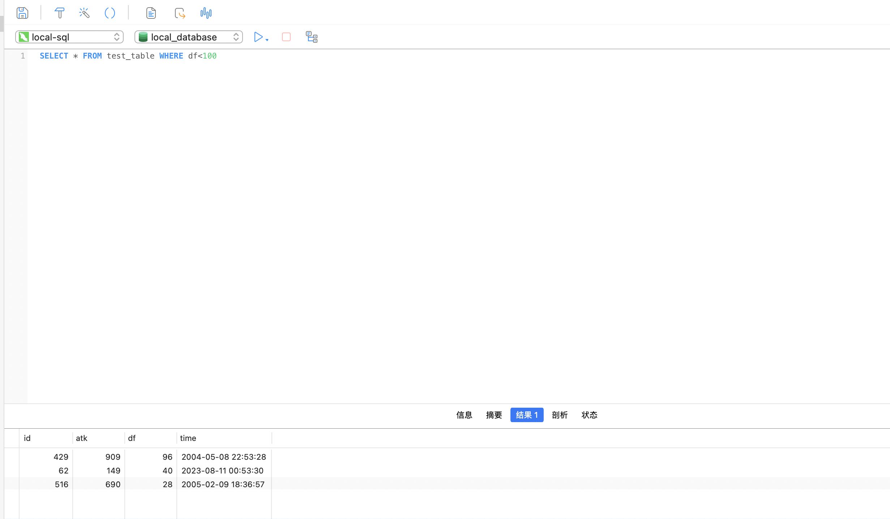

<br>

**2、多条件同时满足查询使用 and 关键字 - 相当于大多数语言的 &&**

```
SELECT * FROM test_table WHERE df<100 AND id >100
```

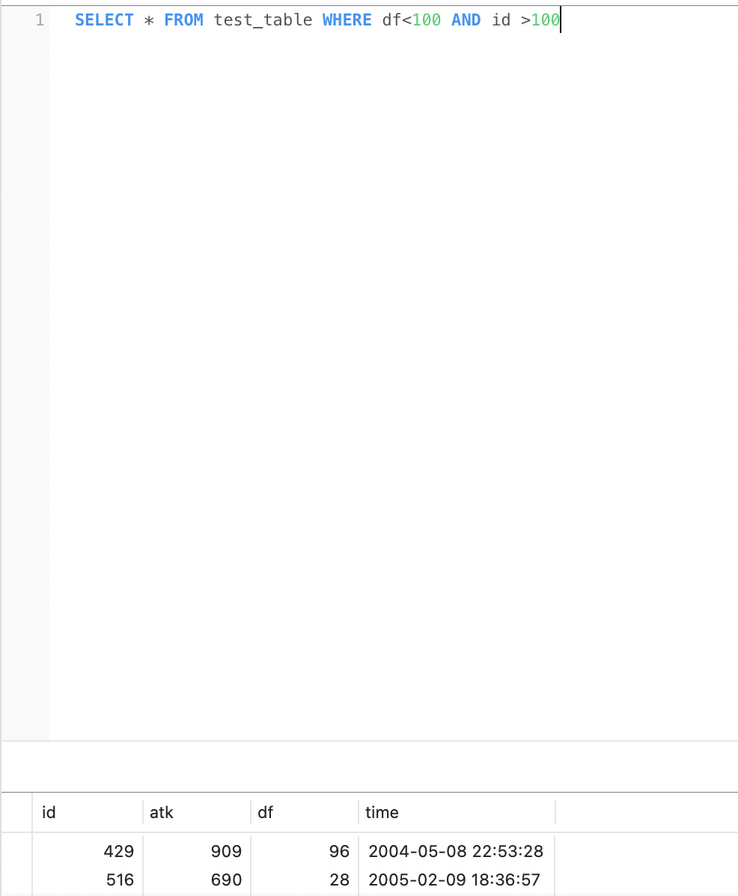

<br>

**3、多条件之一满足查询使用使用 or 关键字 - 相当于大多数语言的 ||**

```
SELECT * FROM test_table WHERE df<100 OR id >100
```

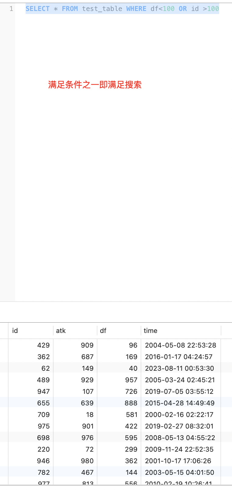

<br>

**4、若想查询某个条件多个不同的值，可使用 in 关键字**

```
SELECT * FROM test_table WHERE id in(56,655)
```

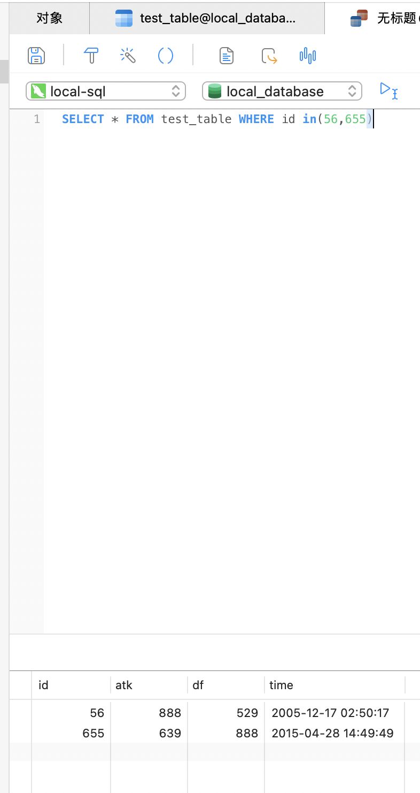

<br>

**5、模糊查询,使用 LIKE 关键字进行模糊查询**

其中 % 代表通配符，即任意内容即可，下面是一个查询个位数为 5 的示例

```
SELECT * FROM test_table WHERE id LIKE '%5'
```

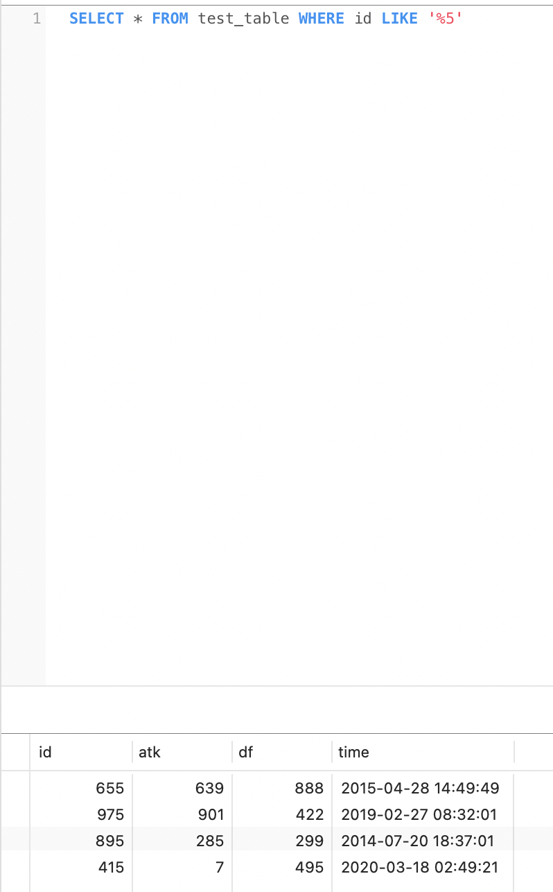

<br>

**6、聚合函数-SUM, COUNT, MAX, AVG 等**

这类函数的作用时取出表内指定字段，并进行对应处理返回最终结果

```
SELECT SUM(id) FROM test_table
```

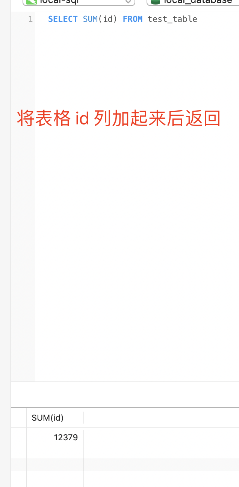

<br>

**7、GROUP BY 用于对数据进行分组**

浅显易懂的理解就是当 GROUP BY 对某个字段进行分组后，该字段下相同值便为一组，可以单独的对其使用聚合函数

```
SELECT status,COUNT(1),SUM(atk) FROM test_table GROUP BY  status
```

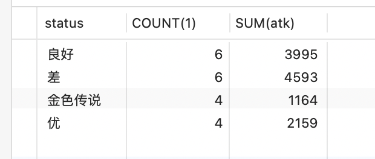

如图便是以以 status 为状态分组，计算各个 status 的数量和 atk 的总和。

<br>

通常还会结合 HAVING 进行使用，HAVING 关键字为对分组的附加条件，可使用 AND 或 OR 等增加条件限制，如

```
SELECT status,COUNT(1),SUM(atk) FROM test_table GROUP BY  status HAVING status!="良好"
```

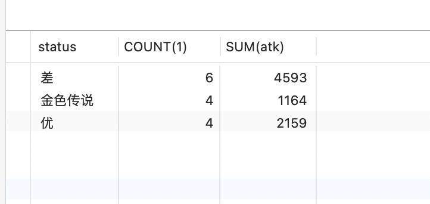

<br>

**8、DISTINCT 关键字用于对数据去重，一般用于获取某字段的全部枚举**

```
SELECT  DISTINCT status  FROM test_table
```

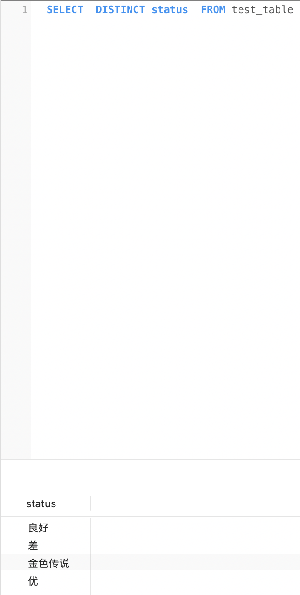
<br>

**9、CASE WHEN**

CASE WHEN 语句常用于打标签或条件性的更新

```
SELECT status,id,
  CASE id
    WHEN 62 THEN '测试1'
    ELSE '测试2'
  END AS test
FROM test_table;
```

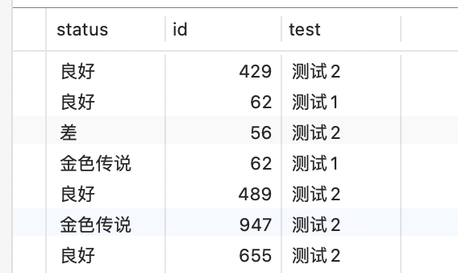
<br>

## 增

**使用 INSERT 语句增加数据库一行,语句为 INSERT INTO <表名> (<各个列名，以逗号分隔>) VALUES (<列名对应的值>)**

```
INSERT INTO test_table 	(id,atk,df,time,status) VALUES (1001,200,900,SYSDATE(),'良好')
```

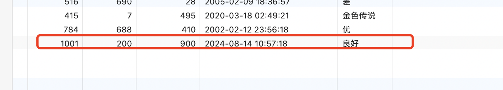
<br>

## 改

**语句为 UPDATE <表名> SET <列名 1=列值 1，列名 2=列值 2> ... WHERE <条件>**

```
UPDATE test_table SET atk=99999,df=999999 WHERE id=1001
```

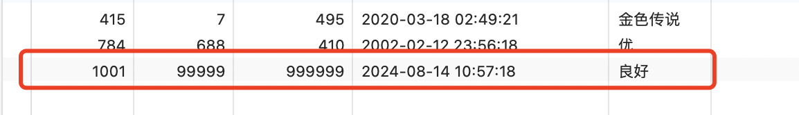

<br>

# 删

**语句为 DELETE FROM <表名> WHERE <条件>**

```
DELETE FROM test_table WHERE id=1001
```

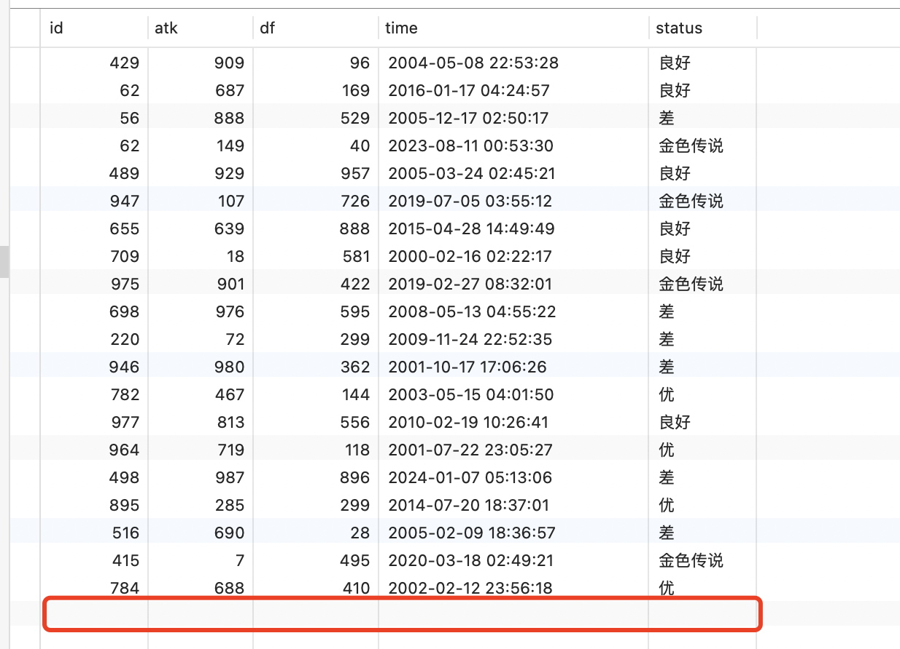
<br>

## 多表链接

**1、内链接**

用于将多个表组合在一起，用法 : SELECT <列名> FROM <表 1> INNER JOIN <表 2> ON <条件>

```
SELECT * FROM test_table INNER JOIN battle_table ON TRUE
```

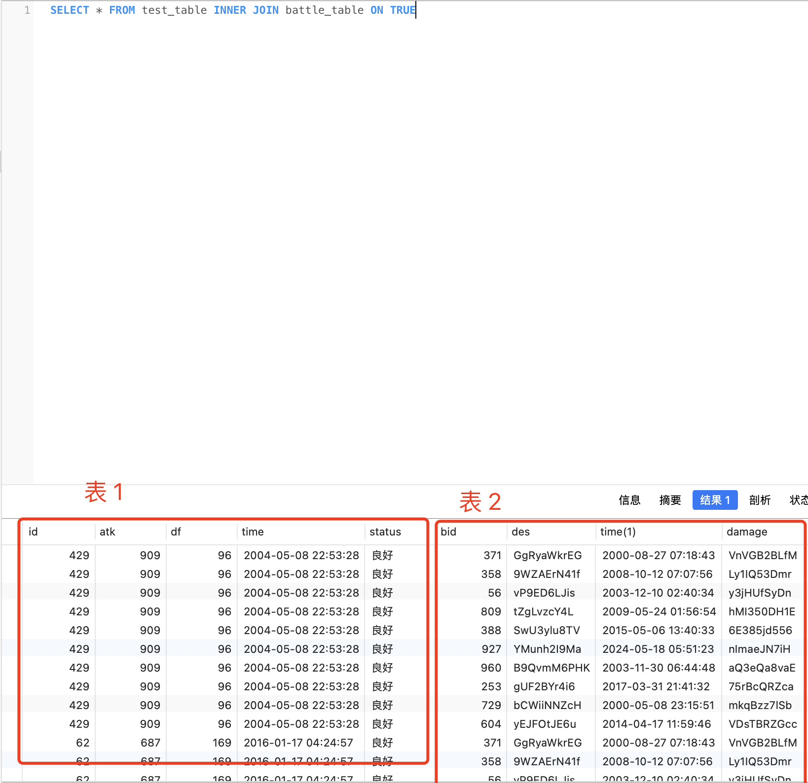
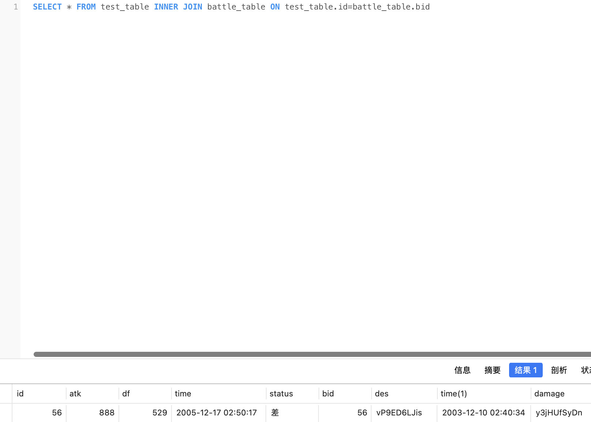

<br>

**2、左/右链接**

与内链接类似，只不过内链接只会将满足条件的内容全部以表的形式给出，
而做链接则是会完全展示第一张表的全部数据，而第二张表不满足条件的部分会以 NULL 给出

```
SELECT * FROM test_table LEFT JOIN battle_table ON test_table.id=battle_table.bid
```

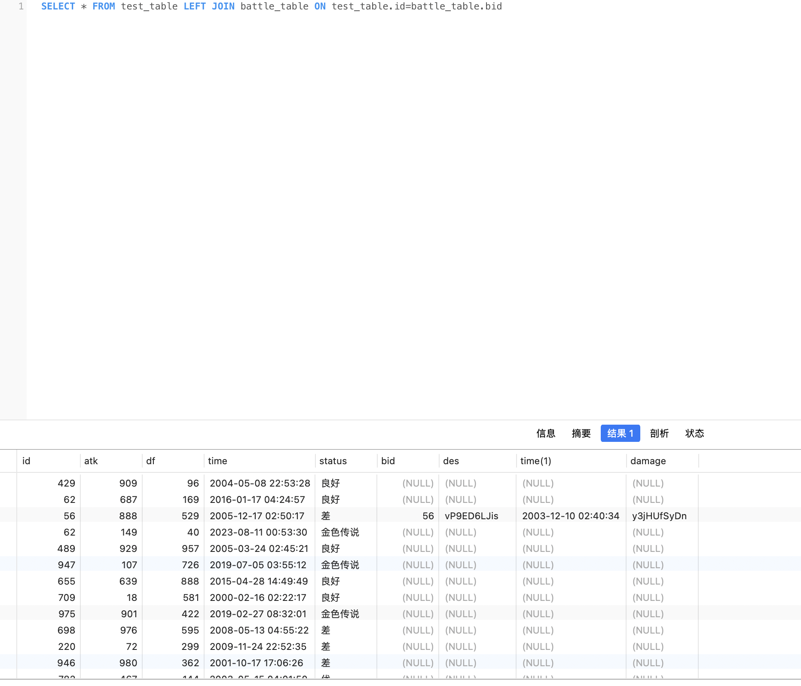

<br>

**3、交叉链接 (笛卡尔积)**

该链接方式没有 on ,会将两个表每行进行组合，如表 1 有 x 行，表 2 有 y 行，那么总共就会有 x\*y 行，其中表 1 的每行数据都会重复 y 次与表 2 进行组合

```
SELECT * FROM test_table CROSS JOIN battle_table
```

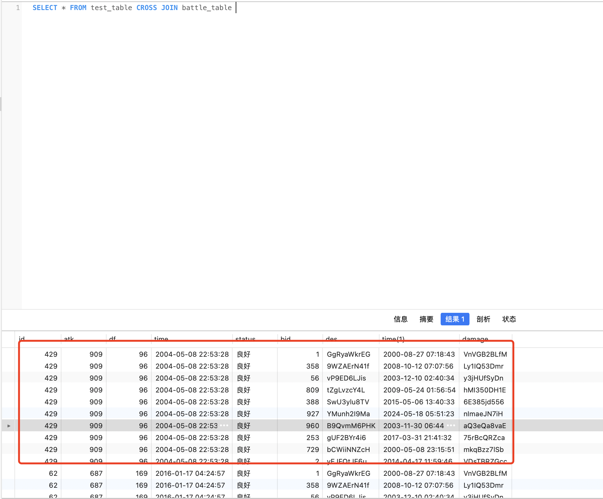

<br>

## 文章参考

https://www.cnblogs.com/lqy-blogs/p/16054809.html <br>
https://www.cnblogs.com/janneystory/p/5618140.html <br>
https://juejin.cn/post/6971040309065187342 <br>
https://mp.weixin.qq.com/s/Lx4B349OlD49ihJPnB6YiA <br>
https://developer.aliyun.com/article/530796 <br>
