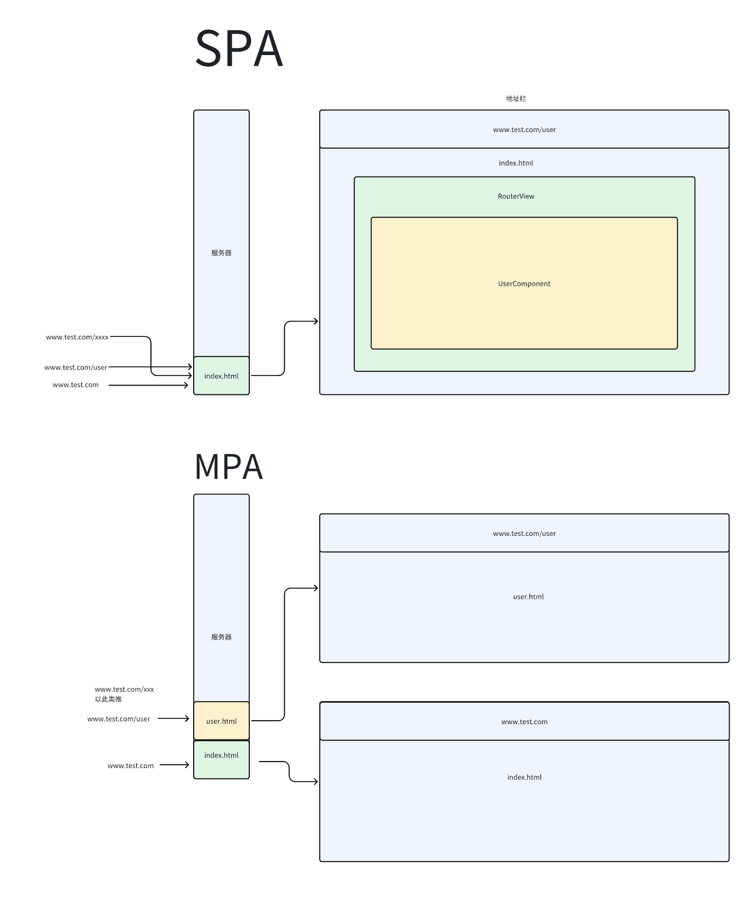
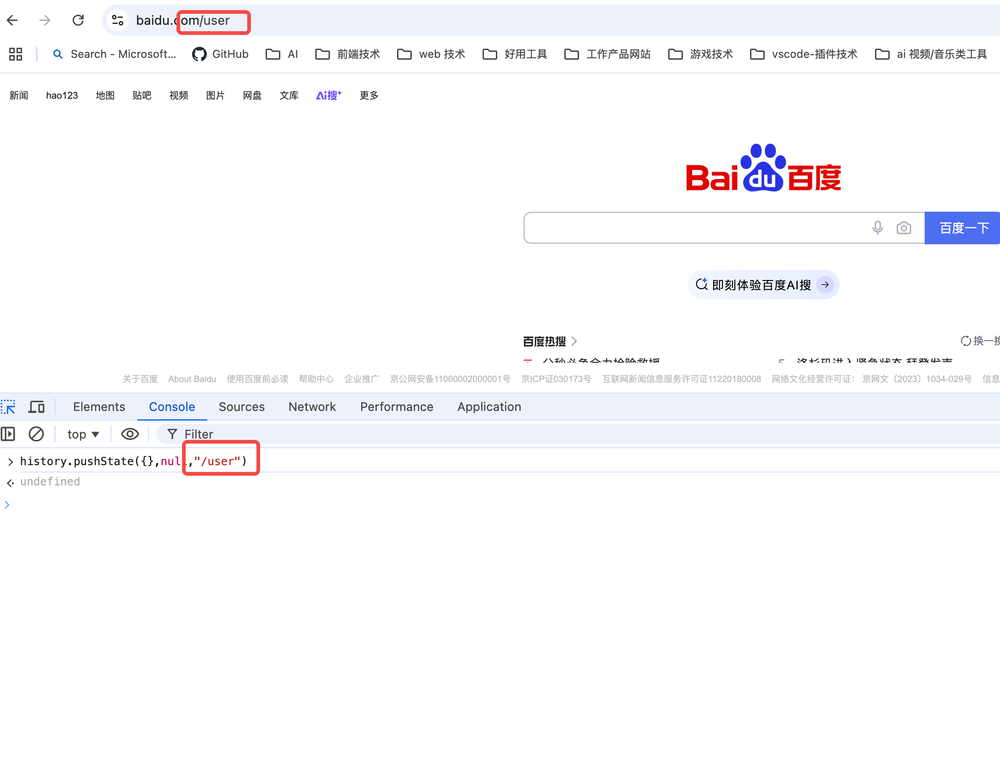

## Vue 双向绑定实现原理

**Vue2 主要借助了 Object.defineProperty 这个 API 。**<br>

实现的大概思路为在 Vue 中 Data 定义的数据，在最开始其所有属性均被 Vue 通过 Object.defineProperty 所监视。<br>

1、get 负责收集依赖，Object.defineProperty 的 get 方法的特性为只要有其他变量读取此属性，便会触发 get 的回调函数；因此可作为依赖收集->即所有对此属性进行了读取操作的行为，都将被收集进依赖数组之中。<br>

举个简单的例子，比如 js 中更新视图的某一个文本，通过 document.getElementById('test').textContent= data.key1 <br>

可以见到此出读取了 data 的 key1 ，那么 document.getElementById('test').textContent 便作为依赖项收集进了依赖数组之中<br>

2、
set 负责更新依赖，Object.defineProperty 的 set 方法的特性为只要修改此属性，便会触发 get 的回调函数；因此可以作为依赖处理器，当有操作对此监听属性进行修改时便会对所有收集的依赖项进行更新<br>

上面举了一个 document.getElementById('test').textContent= data.key1 的例子，其实就相当于 set 行为时重新再执行一遍这个操作，然后值使用新的 data.key1 的值<br>

由此便完成了数据绑定，我们只需要变更数据源，便能自动完成所有依赖此数据源的视图更新

**简单实现**

```
<!DOCTYPE html>
<html lang="en">

<head>
    <meta charset="UTF-8">
    <meta name="viewport" content="width=device-width, initial-scale=1.0">
    <title>Vue 2 双向绑定原理 Demo</title>
</head>

<body>
    <div id="app">
        <input type="text" id="input" />
        <p id="output"></p>
    </div>

    <script>
        class Vue {
            constructor(options) {
                this.$data = options.data; 
                this.observe(this.$data); 
                this.compile(options.el); 
            }

            observe(data) {
                Object.keys(data).forEach(key => {
                    let value = data[key];
                    const dep = new Dep();

                    Object.defineProperty(data, key, {
                        get() {
                            Dep.target && dep.addSub(Dep.target); 
                            return value;
                        },
                        set(newValue) {
                            if (newValue !== value) {
                                value = newValue;
                                dep.notify();
                            }
                        }
                    });
                });
            }

            compile(el) {
                const element = document.querySelector(el);
                const inputs = element.querySelectorAll('input');
                const outputs = element.querySelectorAll('p');
                // 绑定视图与数据
                outputs.forEach(output => {
                    new Watcher(this.$data,'input',val=>{
                        output.textContent = this.$data['input'];
                    })
                });

                inputs.forEach(input => {
                    const key = input.id;
                    input.value = this.$data[key];
                    new Watcher(this.$data, key, value => {
                        input.value = value;
                    });
                    input.addEventListener('input', e => {
                        this.$data[key] = e.target.value;
                    });
                });
            }
        }

        // 依赖收集器
        class Dep {
            constructor() {
                this.subs = [];
            }

            addSub(sub) {
                this.subs.push(sub);
            }

            notify() {
                this.subs.forEach(sub => sub.update());
            }
        }

        class Watcher {
            constructor(data, key, callback) {
                this.data = data;       //
                this.key = key;
                this.callback = callback;
                Dep.target = this;
                this.value = data[key];
                Dep.target = null;
            }

            update() {
                const newValue = this.data[this.key];
                if (this.value !== newValue) {
                    this.value = newValue;
                    this.callback(newValue);
                }
            }
        }

        const vm = new Vue({
            el: '#app',
            data: {
                input: 'Hello Vue!',
            }
        });
    </script>
</body>

</html>
```
上面的例子我们可以看到<br>
```
 outputs.forEach(output => {
   new Watcher(this.$data,'input',val=>{
   output.textContent = this.$data['input'];
 })
});
```
<br>
这一句中对 output 的 textContent 对 this.$data['input'] 进行了读取的操作，因此就被收集进入了依赖项中，后续在用户修改输入框内容时，对 this.$data['input'] 进行了设置的操作，便会自动触发依赖项更新
<br>

```
input.addEventListener('input', e => {
 this.$data[key] = e.target.value;
});
```


**Vue3 双向绑定实现思路大致与 Vue2 相同，只是监听方式从 Object.defineProperty 变成了 Proxy ,再通过 Proxy 的 get 与 set 去劫持与变更**

对比 Vue2 ,主要是处理了以下问题<br>

1、Vue2 无法动态添加响应式数据，同样深层数据也不会进入响应式拦截，因为 Vue2 仅在初始化时调用 Object.defineProperty 对 Data 对象的每个属性进行拦截，后续添加的属性将不会成为响应式数据，因此需要用 set 方法额外处理。<br>
而 Proxy 没有这种限制，Proxy 只要一开始监视了对象，后续新增的属性同样会进入拦截。

2、受限于 Object.defineProperty API 的缘故，Vue2 修改数组类型数据时，不会触发更新，只能手动 set 的方式更新数组类型数据，而 Proxy 可以拦截数组。


## Vue SPA 路由实现原理

首先解释一下 SPA 和 MPA <br>

MPA(多页应用):<br>

在过去互联网起步时，大多数应用都是前后端不分离的，也就是 html 文件直接放置在服务器上，用户通过浏览器到的路由，其实都是真实存在于服务器之上的 html 文件。<br>

MPA 具有首次访问时间短，SEO 能力出色的特点。<br>

SPA(单页应用): <br>

在早期互联网业务简单时，MPA 这种方式没什么问题。随着互联网发展，业务组件复杂，一个页面能展示和提供的功能已无法满足用户，用户会需要频繁的进行跳转<br>

而传统的 MPA 每次访问一个新的路由，就相当于重新请求一次资源，增加用户等待时间并且页面不连续操作割裂感严重，于是便推出了 SPA 的概念。<br>

**SPA 提倡将页面路由交由前端维护，即用户不管如何进行跳转，实际上都只是在一个 index.html 文件里面玩，服务器仅有这一个 html 文件**。不需要重新加载资源，不会有刷新页面的割裂感 <br>




 **history 模式**

主要借助了 window.history.pushState 这个 API 。此 API 具有特性-**只改变地址栏上的 url 而不会进行实际跳转**,同时贮存路径到跳转历史中 <br>

如下图，在 www.baidu.com 调用了 history.pushState({},null,"/user") 后,可以看到顶部地址栏已经变成了 www.baidu.com/user ，但是页面并没有任何变化 <br>



而 Vue 则是利用了这一点，比如说调用 this.$router.push({path:"/user"}) ,将会发生以下逻辑<br>

1、根据 push 的路径，与配置好的文件进行匹配，找到对应组件，比如说 "/user" 路径找到组件 UserComponent <br>

2、将  <RouterView /> 替换对应组件 UserComponent ,解析编译组件，并将其通过 Document 的方式插入到 RouterView<br>

3、调用 history.pushState({},null,"/user") 改变地址栏参数 <br>

经过以上几点，便实现了 SPA 功能。


