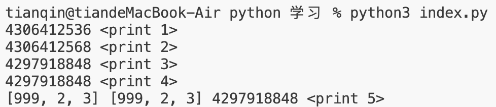
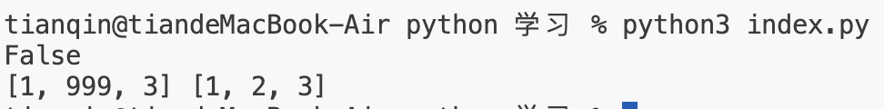
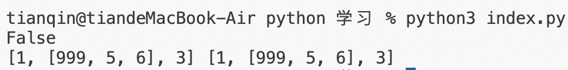
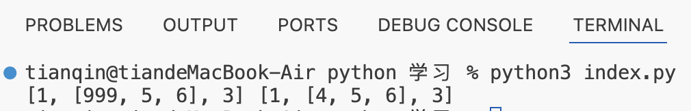

# 背景

与 js 类似，python 中数据也有 6 个基本数据类型，其中分为可变类型与不可变类型<br>

不可变类型： 数字(number)、字符串(string)、元组(tuple)<br>

可变类型：列表(list)、字典(dictionary)、集合(set)<br>

可变类型有点类似于 js 中的引用类型，即数据存贮在一个内存地址之中，而变量仅仅只是地址的指向，如果一个地址被多个变量引用，那么其中一个修改也会影响其他变量的引用值。<br>

下面是一个简单示例可以感受一下，对于不可变类型，每次赋值其实都是赋予一块新的内存地址;而对于可变类型，修改值内容其实并不会让地址发生变化
```
# 不可变类型
a=1
print(id(a),'<print 1>')
a+=1
print(id(a),'<print 2>')

# 可变类型
b=[1,2,3]
c=b
print(id(b),'<print 3>')
b[0]=999
print(id(b),'<print 4>')
print(b,c,id(c),'<print 5>')
```


基于此背景,对于可变类型的复制就变得较为复杂，python 有自己的解决方案 - copy 与 deepcopy。 <br>


# 解决方案

## 浅拷贝 copy

我们从前面的背景知道，对于可变类型，直接变量赋值仅仅只是拷贝的内存地址的引用，修改 b 的内容也会影响到 c, 使用 copy 模块即可解决这个问题。
<br>

```
import copy
b=[1,2,3]
c=copy.copy(b)
print(id(b)==id(c))
b[1]=999
print(b,c)
```


<br>

可以看到使用 copy 方法后变量的内存地址不一致了，同时对 c 的修改也不会影响到 b 了。


## 深拷贝 deepcopy 

上面我们介绍了浅拷贝，不过该方法也有缺陷，就是如果可变类型内部存在其他可变类型，对内部的可变类型进行修改还是会相关联，故才有了深拷贝。
<br>

浅拷贝缺陷示例
```
import copy
b=[1,[4,5,6],3]
c=copy.copy(b)
b[1][0]=999
print(b,c)
```


<br>

深拷贝示例

```
import copy
b=[1,[4,5,6],3]
c=copy.deepcopy(b)
b[1][0]=999
print(b,c)
```


可以看到现在深层的数据也是独立的内存地址了，修改深层数据不会出现前面相关联的情况