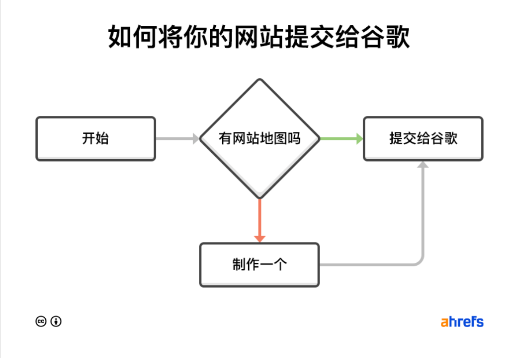

# 序

这个篇章主要记录对 SEO、流量、热点相关的理解和知识  

# SEO

首先解释一下什么是 SEO，SEO 全称为 Search Engine Optimization ,翻译过来就是搜索引擎优化，像我们平常使用的百度、谷歌等都是搜索引擎，SEO 便是了解其机制并提升站点曝光度的手段。 

为什么会有搜索引擎的存在？试想一下，如果没有搜索引擎，人们该如何访问互联网的各个网站？答案是只能通过地址栏直接输入网站的域名进行访问，而搜索引擎，本质其实也是一个网站，只是这个网站收集了全世界大部分的域名及他们的关键字，让人们可以通过一些关键字检索直接跳转到对应域名。简单来说它就像是一个电话本，我们通过电话本的名字就能查具体的电话。

其工作原理参考 [SEO 指南](https://ahrefs.com/zh/seo),里面非常详细的解释了概念。

由于世界上大部分人使用的搜索引擎是 Google,故着重研究 Google 。

Google 具有 200 多个排名因素，其中最重要的几个因素为

外链  
相关性 
新鲜度 
话题权威性 
页面速度 
移动友好 

简单介绍一下这几个因素吧。 

外链-来自其他网站的链接就像“投票”一样，向谷歌展示其他人在为你的内容提供担保，可以提升你的可信度和搜索排名 

相关性-简单来说，就是词汇与历史特征相关性高的排名会靠前，比如说搜苹果，会弹出 iphone 而不是水果的苹果，但是搜香蕉则会出现水果的香蕉。同理如果你的关键词距离行业越近，越能解决用户的提问，那么排名就越有可能靠前。 

新鲜度-越新的话题排名越靠前。 

权威性-在特定领域具有更专业可信度的网站排名会靠前。简单理解就是购物中心，它里面有各式各样的商品对吧，大型购物中心一般还会卖车，但是如果你要买车，购物中心会是最优选择吗？当然不是，一般还是会去专门的品牌专卖店。这就是权威性，在领域内更有话语权的网站，就会在此领域搜索中获得更高排名 

页面速度和移动友好-这两属于纯技术层面顾名思义，不过多讨论 

# sitemap
简单来说，就是一份你网站的地图。假如你建立了一个网站，如何才能让搜索引擎知道你网站内容及内部的链接指引呢？答案是提供一份网站地图给搜索引擎，Google 需要你在站点根目录下添加一个 sitemap.xml 或者 sitemap_index.xml 命名的 xml 文件，此 xml 文件包含着站点内部所有路由导航等，可使用[Screaming Frog](https://www.screamingfrog.co.uk/seo-spider/) 进行制作，其会自动模拟搜索引擎爬取你的页面并制作出 xml 文件。 
最后登陆 [谷歌站长工具](https://search.google.com/search-console/welcome?hl=zh-CN) ，找到 Sitemaps -> Add a new sitemap ，填入放在服务器上的 sitemap.xml 路径即可。 

# 关键字分析

Search volume (搜索量) 
Clicks (点击) 
Traffic potential (流量潜力) 
Keyword Difficulty (关键词难度) 
Cost Per Click (CPC) 

# 需求小技巧
1、可以观察广告投入量大的产品，广告投入量大，说明肯定是一个赚钱的生意，可以做，可以研究差异化和市场。

参考：
https://ahrefs.com/zh/seo